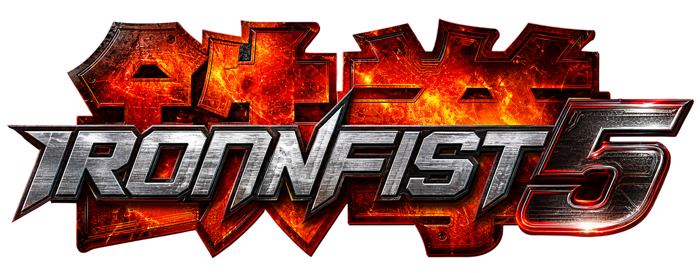

<p align="center">
  
</p>

# IronFist 5

**IronFist 5** es el nombre oficial de este proyecto. El objetivo técnico sigue siendo reconstruir y recompilar Tekken 5 PS2 NTSC-U de forma nativa para PC.

Proyecto de **investigación, ingeniería inversa y desarrollo** con el
objetivo a largo plazo de construir un **port nativo de Tekken 5
(PlayStation 2, Namco, 2005) para PC**, manteniendo en la medida de lo
posible el comportamiento del juego original.

> **Estado actual: el proyecto se encuentra en fase de investigación y
> análisis. No existe ningún port funcional. No se ha recompilado ni
> ejecutado todavía ninguna parte del juego.**

---

## Visión del proyecto

```text
Tekken 5 — PlayStation 2
          │
          ▼
  Ingeniería inversa (Ghidra + PCSX2 como herramientas de investigación)
          │
          ▼
 Análisis del ELF / PS2
          │
          ▼
      PS2Recomp (recompilación estática)
          │
          ▼
   C/C++ recompilado
          │
          ▼
Reconstrucción del runtime (memoria, syscalls, IOP)
          │
          ▼
Sustitución de dependencias PS2 (GS, VU1, audio, input)
          │
          ▼
     Runtime para PC
          │
          ▼
      Port nativo
          │
          ▼
Arquitectura independiente del hardware original
          │
          ▼
 (Futuro, fuera de alcance actual) evaluación de Rust / Bevy
```

La filosofía de trabajo es, en este orden:

> **Entender primero. Verificar después. Documentar después. Implementar
> finalmente.**

## Objetivo

Comprender suficientemente el funcionamiento del juego original (ELF,
sistemas internos, formatos de datos) para poder ejecutar una
implementación nativa en PC que preserve el comportamiento original. La
futura reescritura en Rust/Bevy es una posibilidad que **solo se evaluará
cuando la versión nativa esté suficientemente comprendida** (ver
`future/rust-bevy/`).

## Metodología

```text
Investigación → Ingeniería inversa → Análisis → Recompilación →
Reconstrucción del runtime → Port nativo
```

Cada descubrimiento importante se registra como un **hallazgo** con
identificador único (`TK5-0001`, `TK5-0002`, …) en `research/hallazgos/`,
con evidencia, fuente y un nivel de confianza explícito (`VERIFICADO`,
`MUY BIEN RESPALDADO`, `PROBABLE`, `HIPÓTESIS`, `DESCONOCIDO`,
`PENDIENTE DE VERIFICACIÓN`). Ver
`docs/investigacion/metodologia.md`.

Las reglas permanentes del proyecto (no asumir, exigir evidencia, no
mezclar versiones, respetar licencias, no distribuir datos propietarios)
están en `AGENTS.md`, y son de obligado cumplimiento para cualquier
contribuidor, humano o artificial.

## Versiones objetivo

**Versión canónica de trabajo: NTSC-U, `SLUS-21059`, versión de producto
1.00, EXE date 2005-02-08.**

Justificación completa (hashes de verificación, comparación de builds,
documentación comunitaria disponible) en el hallazgo
[TK5-0018](research/hallazgos/TK5-0018.md) y en
`docs/investigacion/versiones-tekken5.md`. Resumen de las tres versiones
regionales verificadas (redump.org):

| Región | Serial | EXE date | Versión | MD5 |
|---|---|---|---|---|
| **NTSC-U (canónica)** | `SLUS-21059` | 2005-02-08 | 1.00 | `7472a628307a0e4309aef66c14d6dbc4` |
| NTSC-J | `SLPS-25510` | 2005-03-07 | 1.01 | `246ea391261c89d979cb6d2699f87ae2` |
| PAL | `SCES-53202` | 2005-05-10 | 1.00 | `bc0685727cf9d68e04da3e166b33016e` |

Las tres son builds distintos: ninguna dirección de memoria u offset es
intercambiable entre ellas (hallazgos TK5-0001/0002/0003).

## Estado del proyecto

| Área | Estado |
|---|---|
| Organización, reglas y metodología | ✅ Completado |
| Investigación de versiones y selección de versión canónica | ✅ Completado |
| Investigación de PS2Recomp | ✅ Completado (documental; sin ejecutar todavía) |
| Investigación de Ghidra + extensiones PS2 | ✅ Completado (documental) |
| Investigación de proyectos similares | ✅ Completado (primera pasada) |
| Investigación de herramientas de la comunidad de Tekken | ✅ Completado (primera pasada) |
| Registro de licencias externas | ✅ Completado (con pendientes de confirmación) |
| Sistema de hallazgos | ✅ Operativo (TK5-0001 a TK5-0019) |
| Backlog y roadmap | ✅ Operativos |
| Análisis experimental del ELF real | ⏳ Pendiente (requiere copia legal local) |
| Primer análisis en Ghidra | ⏳ Pendiente |
| Reconocimiento del filesystem | ⏳ Pendiente |
| Recompilación con PS2Recomp | ⛔ Bloqueada por lo anterior |
| Runtime / código de juego | ⛔ Bloqueada (fase futura, ver roadmap) |

Los bloqueos actuales son, fundamentalmente, de acceso a datos: este
repositorio no contiene ni contendrá nunca el juego, y el análisis
experimental del ELF requiere que cada colaborador use **localmente** su
propia copia legal.

## Hoja de ruta (resumen)

- **Fase 0 (actual)** — Investigación y organización.
- **Fase 1** — Primer objetivo técnico demostrable: una función real y no
  trivial del ELF, identificada en Ghidra, recompilada con PS2Recomp,
  compilada y ejecutada en el runtime, con resultado verificable contra
  PCSX2. Sin gráficos. Ver `docs/desarrollo/primer-milestone.md`.
- **Fase 2** — Mapeo progresivo de funciones y sistemas.
- **Fase 3** — Runtime mínimo ejecutando código real sin gráficos.
- **Fase 4** — Reconstrucción de sistemas independientes.
- **Fase 5** — Renderizado y reimplementación de subsistemas no
  recompilables (GS/VU1).
- **Fase 6** — Port nativo jugable.
- **Fase 7 (futura)** — Evaluación de reescritura en Rust/Bevy.

Detalle y criterios de cada fase: `docs/desarrollo/roadmap.md`.

## Herramientas principales

| Herramienta | Rol | Licencia |
|---|---|---|
| [PS2Recomp](https://github.com/ran-j/PS2Recomp) | Recompilador estático ELF→C++ + runtime | GPL-3.0 |
| [Ghidra](https://ghidra-sre.org/) + [ghidra-emotionengine-reloaded](https://github.com/chaoticgd/ghidra-emotionengine-reloaded) | Análisis del ELF (R5900, MMI, VU0 macro, STABS) | Apache-2.0 (extensión) |
| [PCSX2](https://github.com/PCSX2/pcsx2) | Emulador, usado **solo como herramienta de investigación** | GPL-3.0 |
| [ccc](https://github.com/chaoticgd/ccc) | Parseo de símbolos STABS/.mdebug (si el ELF los tiene) | A confirmar |
| [Play!](https://github.com/jpd002/Play-) | Emulador alternativo, exploratorio | A confirmar |

Registro completo de licencias: `docs/investigacion/licencias.md`.

## Investigación (índice de documentación)

- `docs/investigacion/metodologia.md` — Niveles de confianza y plantilla
  de hallazgos.
- `docs/investigacion/versiones-tekken5.md` — Versiones, hashes,
  diferencias entre builds.
- `docs/investigacion/ps2recomp.md` — Investigación profunda de PS2Recomp
  (qué automatiza y qué tendremos que construir).
- `docs/investigacion/emulacion.md` — PCSX2/Play! como herramientas de
  investigación.
- `docs/investigacion/proyectos-similares.md` — God Hand Decomp y otros.
- `docs/investigacion/herramientas-comunidad.md` — TekkenMovesetExtractor,
  Noesis, csplitb, etc.
- `docs/investigacion/licencias.md` — Registro de licencias externas.
- `docs/investigacion/busquedas-realizadas.md` — Qué se ha buscado y qué
  queda pendiente.
- `docs/ingenieria-inversa/elf-analisis.md` — Qué sabemos y qué falta por
  determinar del ELF.
- `docs/ingenieria-inversa/artefactos-y-exclusiones.md` — Qué se puede
  versionar y qué debe permanecer local.
- `docs/ingenieria-inversa/workflow-ghidra.md` — Procedimiento de análisis
  con Ghidra.
- `docs/devil-within/` — Investigación separada de Devil Within: arquitectura,
  gameplay, plan y preguntas abiertas.
- `docs/ps2/arquitectura-ee.md` — Arquitectura PS2 y qué usa realmente
  Tekken 5 (gran parte: todavía desconocido).
- `docs/arquitectura/decompilacion-vs-recompilacion.md` — Las cuatro
  técnicas, sin confundirlas.
- `docs/arquitectura/arquitectura-futura.md` — Separación de sistemas
  (exploratorio).
- `docs/desarrollo/roadmap.md` — Hoja de ruta completa.
- `docs/desarrollo/primer-milestone.md` — Primer objetivo técnico
  propuesto.
- `docs/desarrollo/backlog.md` — Tareas concretas de investigación.
- `docs/desarrollo/problemas-conocidos.md` — Problemas técnicos
  identificados.
- `docs/desarrollo/incognitas.md` — Qué no sabemos todavía.
- `docs/desarrollo/testing-diferencial.md` — Estrategia futura de
  comparación contra el juego original.
- `research/hallazgos/` — Registro completo de hallazgos (`TK5-`, `DW-`,
  `PS2-`, `RECOMP-`, `ASSET-` y `MEM-`), con índice en
  `research/hallazgos/README.md`.

## Estructura del repositorio

```text
ironfist5/
├── README.md              ← este archivo
├── AGENTS.md              ← reglas permanentes del proyecto
├── LICENSE                ← GPL-3.0
├── CONTRIBUTING.md        ← cómo contribuir
│
├── docs/
│   ├── arquitectura/      ← visión técnica, técnicas, arquitectura futura
│   ├── investigacion/     ← investigación documental de fuentes externas
│   ├── ingenieria-inversa/ ← workflows: ELF, Ghidra
│   ├── ps2/               ← arquitectura de la consola
│   ├── renderizado/       ← GS, VU1, pipeline de render (a desarrollar)
│   ├── animacion/         ← sistema de animación (a desarrollar)
│   ├── audio/             ← sistema de audio (a desarrollar)
│   ├── gameplay/          ← sistemas de combate (a desarrollar)
│   ├── devil-within/      ← línea de investigación independiente
│   └── desarrollo/        ← roadmap, backlog, problemas, incógnitas, testing
│
├── research/
│   ├── elf/               ← notas de análisis del ELF (sin el ELF jamás)
│   ├── ghidra/            ← mapas de funciones, artefactos de análisis
│   ├── memoria/           ← direcciones de memoria (pistas comunitarias)
│   ├── filesystem/        ← estructura del disco
│   ├── assets/            ← formatos de assets
│   ├── simbolos/          ← mapas de símbolos (formato para herramientas)
│   └── hallazgos/         ← registro de hallazgos TK5-XXXX
│
├── tools/                 ← herramientas propias de análisis (vacío por ahora)
├── runtime/               ← futuro runtime del código recompilado (vacío)
├── src/                   ← código propio futuro (vacío)
├── tests/                 ← pruebas, incl. testing diferencial futuro (vacío)
└── future/
    └── rust-bevy/         ← exploración futura, FUERA del desarrollo activo
```

Los directorios técnicos (`tools/`, `runtime/`, `src/`, `tests/`) están
vacíos deliberadamente: contienen un `README.md` explicando su propósito y
sus condiciones de uso. Escribir código de implementación antes de
investigar violaría las reglas del proyecto (`AGENTS.md`, Regla 9).

## Legalidad y distribución

Este repositorio **no contiene ni contendrá nunca**:

- ISOs, ROMs, imágenes de disco ni volcados del juego.
- El ELF, overlays o módulos IOP extraídos del juego.
- Texturas, modelos, animaciones, audio, vídeo ni ningún otro asset
  extraído de Tekken 5.
- BIOS de PlayStation 2.
- Ningún dato derivado directamente de una copia del juego.

Cualquier persona que quiera reproducir el trabajo de este proyecto debe
usar **su propia copia legal** de Tekken 5 (por ejemplo, una copia física
original) y verificarla contra los hashes públicos documentados en el
hallazgo [TK5-0002](research/hallazgos/TK5-0002.md). Las herramientas y
scripts de este repositorio están diseñados para operar sobre datos
aportados localmente por cada usuario, nunca para distribuirlos.

Tekken 5 es © 2005 Namco/Bandai Namco. Este proyecto no está afiliado a
Namco ni a Sony Interactive Entertainment. Es un esfuerzo de preservación
e ingeniería inversa sin ánimo de lucro, sin distribución de contenido
propietario.

## Créditos

Esta sección lista únicamente los proyectos y fuentes cuyo uso directo o
cuya atribución está respaldada por la documentación de este repositorio
(ver `docs/investigacion/licencias.md`). IronFist 5 **no incorpora código
vendorizado, submódulos ni binarios** de ninguno de ellos: son
dependencias externas previstas o herramientas ejecutadas localmente por
cada colaborador (ver "Estado de integración en IronFist 5" en
`docs/investigacion/licencias.md`).

- **[PS2Recomp](https://github.com/ran-j/PS2Recomp)** (ran-j y
  contribuidores, GPL-3.0) — recompilador estático ELF→C++ y su runtime;
  pieza central de la visión del proyecto. Uso previsto: dependencia
  externa **no vendorizada** para la futura fase de recompilación.
- **[ghidra-emotionengine-reloaded](https://github.com/chaoticgd/ghidra-emotionengine-reloaded)**
  (chaoticgd, Apache-2.0) — soporte R5900/PS2 (MMI, VU0 macro, STABS)
  para Ghidra, instalado como extensión externa. Su antecedente, el
  original
  [ghidra-emotionengine](https://github.com/beardypig/ghidra-emotionengine)
  (beardypig), se cita como referencia histórica; su licencia está
  **pendiente de verificación** (`docs/investigacion/licencias.md`).
- **PCSX2 Team** ([PCSX2](https://github.com/PCSX2/pcsx2), GPL-3.0) —
  emulador usado **solo como herramienta de investigación** (depuración y
  volcados de memoria sobre la copia legal de cada colaborador).
- **[redump.org](http://redump.org)** — fuente primaria de los hashes de
  disco verificados que anclan la identificación de versiones
  ([TK5-0002](research/hallazgos/TK5-0002.md),
  [TK5-0018](research/hallazgos/TK5-0018.md)).

## Referencias metodológicas y de investigación

Los proyectos y fuentes de esta sección **no son dependencias ni código
incorporado**: se han estudiado como referencia metodológica o como
pistas de investigación. Su documentación completa está en
`docs/investigacion/proyectos-similares.md`,
`docs/investigacion/herramientas-comunidad.md` y en los hallazgos
correspondientes.

- **[God Hand Decomp](https://github.com/LucasPicoli/god-hand-decomp)** —
  referencia metodológica de decompilación por matching en PS2 (otro
  juego y otro estudio). Licencia **no verificada**: no se reutiliza
  código ([TK5-0012](research/hallazgos/TK5-0012.md)).
- **[TekkenMovesetExtractor](https://github.com/Kiloutre/TekkenMovesetExtractor)**
  (Kiloutre, GPL-3.0, archivado por su autor) — herramienta de la
  comunidad de Tekken **en evaluación**: su aplicabilidad a Tekken 5 PS2
  retail no está confirmada y no hay ningún uso previsto confirmado, por
  lo que no es una dependencia del proyecto
  ([TK5-0011](research/hallazgos/TK5-0011.md)).
- Comunidad de parches de PS2 (nemesis2000, elhecht y otros autores
  documentados en [TK5-0009](research/hallazgos/TK5-0009.md)) — fuente de
  investigación comunitaria: sus direcciones de memoria son **pistas
  PENDIENTES DE VERIFICACIÓN** por este proyecto, no dependencias ni
  datos confirmados.

## Contacto y contribuciones

Ver `CONTRIBUTING.md`. En esta fase se agradecen especialmente:
verificaciones experimentales de pistas marcadas como "PENDIENTE DE
VERIFICACIÓN", correcciones a hallazgos, y nuevas fuentes documentales.
